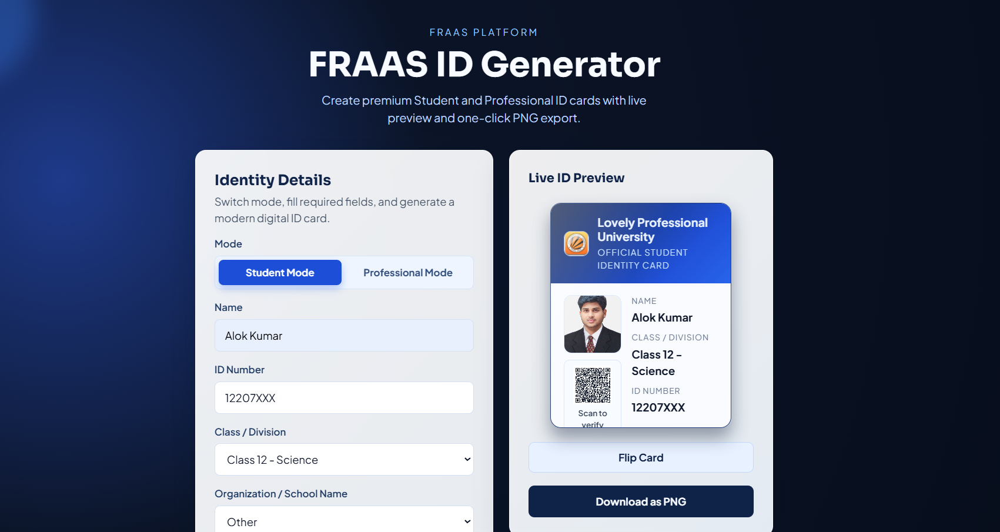

# FRAAS ID Generator

Maintained by **Alok Kumar**

Portfolio: [https://alokkumar.vercel.app/](https://alokkumar.vercel.app/)
LinkedIn: [https://www.linkedin.com/in/alokkumar48/](https://www.linkedin.com/in/alokkumar48/)

Copyright (c) 2026 Alok Kumar. All rights reserved.

A premium, modern student ID card generator with a clean dashboard-style interface.

## 🎬 Website Demo

Latest flip-card UI preview:

  

---

## Features

- **FRAAS Branding**: Updated app title and UI copy to FRAAS ID Generator.
- **Simplified Form**: Essential fields only - Student Name, Roll Number/ID, Class/Division, School Name, and Photo.
- **Smart School Input**: Dropdown for predefined schools with an "Other" option for custom school entry.
- **Live ID Preview**: Real-time preview updates while typing.
- **Premium Card Design**: Realistic card with school header, student photo, and aligned identity details.
- **Download as PNG**: Export the generated card in one click.
- **Responsive UI**: Works on desktop and mobile with a polished card-based layout.

## Technologies Used

- React.js with Vite
- Pure CSS for styling (no frameworks)
- qrcode.react for QR code generation
- html-to-image for downloading cards as PNG

## Design Direction

- SaaS-inspired premium look and feel
- Dark blue + white palette with subtle gradients
- Rounded cards, layered shadows, and smooth hover transitions
- Google Fonts for clean typography

## Installation and Usage

1. Clone the repository
2. Run `npm install` to install dependencies
3. Run `npm run dev` to start the development server
4. Open your browser to the URL displayed in the terminal
